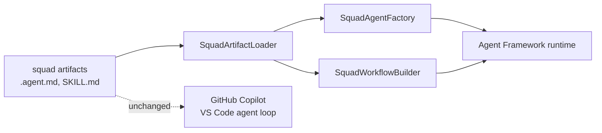

# hve-squad-maf

Runs [hve-squad](https://github.com/Peter-N91/hve-squad) on
[Microsoft Agent Framework](https://github.com/microsoft/agent-framework).

hve-squad has no runtime of its own. It is a package of declarative markdown — agent charters with
YAML frontmatter, a roster table, routing and state instructions, and skills — executed by the
GitHub Copilot agent loop in VS Code. This repository gives those same artifacts a second runtime
host, so a squad can also run under MAF and be reached from DevUI, A2A, MCP clients, or Microsoft
Foundry.

The markdown stays authoritative. Nothing here duplicates an agent definition; the loader reads the
artifacts the Copilot host already reads.

> Status: proof of concept. The loader and graph assembly are verified against the real artifact
> tree. Running a squad end-to-end against a live model has not been validated.

## Design

The decision to build an adapter rather than fork MAF or rewrite the squad in C# is recorded in
[ADR-0001](https://github.com/Peter-N91/hve-squad/blob/main/docs/planning/adrs/0001-host-hve-squad-on-microsoft-agent-framework-via-adapter.md)
in the hve-squad repository.



| Layer                  | Type                    | Responsibility                                              |
|------------------------|-------------------------|-------------------------------------------------------------|
| Artifact loader        | `SquadArtifactLoader`   | Parses charters, the roster, and skill directories          |
| Agent factory          | `SquadAgentFactory`     | Materializes each charter as a MAF `AIAgent`                |
| Workflow builder       | `SquadWorkflowBuilder`  | Turns stages and `agents:` allowlists into workflow graphs  |
| Fluent entry point     | `HveSquadBuilder`       | Composes the three layers                                   |

### Artifact mapping

| hve-squad artifact                           | Agent Framework primitive                     |
|----------------------------------------------|-----------------------------------------------|
| `.agent.md` frontmatter `name`/`description` | `ChatClientAgentOptions.Name`/`.Description`  |
| `.agent.md` body                             | `ChatOptions.Instructions`                    |
| `model:` list                                | chat client selection via `WithChatClientSelector` |
| `agents:` allowlist                          | handoff edges                                 |
| `team.md` roster                             | role to charter resolution                    |
| `SKILL.md` directories                       | MAF `AgentFileSkill` sources                  |

## Usage

```csharp
var squad = new HveSquadBuilder()
    .FromArtifacts(@"C:\my-project\.github", rosterPath: @"C:\my-project\.copilot-tracking\squad\team.md")
    .WithChatClient(chatClient)
    .WithOpenTelemetry()
    .WithAgent("Squad Researcher")
    .WithAgent("Squad Lead")
    .WithAgent("Squad Reviewer")
    .Build();

Console.WriteLine(squad.ToMermaid());
```

Roles resolve through the roster when it exists:

```csharp
    .WithRole("lead")
    .WithRole("developer")
```

### Inspect an artifact tree

The sample renders the graph offline, with no model credentials:

```powershell
dotnet run --project samples/HveSquad.AgentFramework.Sample -- C:\Solutions\hve-squad\.github C:\Solutions\hve-squad\.agents
```

```text
Charters:  83
Skills:    62
Roster:    0 member(s)

Staged workflow:
flowchart TD
  ...
```

## What the artifact tree actually looks like

Building this surfaced four facts that are easy to get wrong:

1. **A squad source tree is an incomplete graph.** `squad-src/.github` charters delegate to HVE Core
   agents that arrive only through package install. Point the loader at the deployed `.github`, or
   pass both roots.
2. **Skills do not live under `.github`.** They deploy to `.agents/skills/`, so skill discovery needs
   its own root.
3. **The deployed tree is flat; the source tree is nested.** Discovery must be recursive and must not
   assume either layout.
4. **Not every charter declares `name:`.** The host falls back to the filename, and so does the
   loader.

`SquadArtifacts.FindUnresolvedDelegations()` reports dangling `agents:` edges, which is the fastest
way to tell whether every dependency root was supplied.

## Build

```powershell
dotnet build
dotnet test
```

The real-artifact tests locate hve-squad automatically when it is checked out beside this
repository, or via the `HVE_SQUAD_ROOT` environment variable. They pass silently when it is absent.

## Repository layout

- `src/HveSquad.AgentFramework/`: the adapter library
- `tests/HveSquad.AgentFramework.Tests/`: fixture and real-artifact tests
- `samples/HveSquad.AgentFramework.Sample/`: offline artifact inspector
- `tools/ApiDump/`: reflection helper for checking the MAF API surface after a version bump

## Not yet built

Python parity, memory retrieval policy, consumption accounting over OpenTelemetry spans,
multi-repository delivery, MCP hosting for Copilot Studio, and mapping the Impactful-Action Gate onto
`ToolApprovalAgent`. Each is a deferred decision in ADR-0001.

## License

MIT. See [LICENSE](LICENSE).

This project depends on Microsoft Agent Framework and hve-squad, which carry their own licenses. It
is not affiliated with or endorsed by Microsoft.
