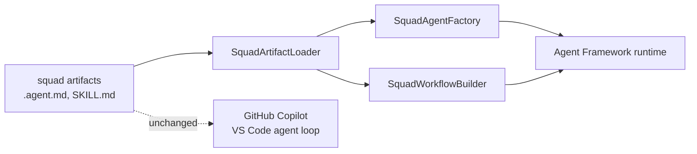

# hve-squad-maf

Runs [hve-squad](https://github.com/Peter-N91/hve-squad) on
[Microsoft Agent Framework](https://github.com/microsoft/agent-framework).

hve-squad has no runtime of its own. It is a package of declarative markdown — agent charters with
YAML frontmatter, a roster table, routing and state instructions, and skills — executed by the
GitHub Copilot agent loop in VS Code. This repository gives those same artifacts a second runtime
host, so a squad can also run under MAF and be reached from DevUI, A2A, MCP clients, or Microsoft
Foundry.

The markdown stays authoritative. Nothing here duplicates an agent definition; the loader reads the
artifacts the Copilot host already reads.

> Status: proof of concept. The loader and graph assembly are verified against the real artifact
> tree. Running a squad end-to-end against a live model has not been validated.

## Design

The decision to build an adapter rather than fork MAF or rewrite the squad in C# is recorded in
[ADR-0001](https://github.com/Peter-N91/hve-squad/blob/main/docs/planning/adrs/0001-host-hve-squad-on-microsoft-agent-framework-via-adapter.md)
in the hve-squad repository.



| Layer                  | Type                    | Responsibility                                              |
|------------------------|-------------------------|-------------------------------------------------------------|
| Artifact source        | `SquadArtifactSource`   | Locates or acquires the artifact directories                |
| Artifact loader        | `SquadArtifactLoader`   | Parses charters, the roster, and skill directories          |
| Agent factory          | `SquadAgentFactory`     | Materializes each charter as a MAF `AIAgent`                |
| Workflow builder       | `SquadWorkflowBuilder`  | Turns stages and `agents:` allowlists into workflow graphs  |
| Fluent entry point     | `HveSquadBuilder`       | Composes the layers                                          |

### Artifact mapping

| hve-squad artifact                           | Agent Framework primitive                     |
|----------------------------------------------|-----------------------------------------------|
| `.agent.md` frontmatter `name`/`description` | `ChatClientAgentOptions.Name`/`.Description`  |
| `.agent.md` body                             | `ChatOptions.Instructions`                    |
| `model:` list                                | chat client selection via `WithChatClientSelector` |
| `agents:` allowlist                          | handoff edges                                 |
| `team.md` roster                             | role to charter resolution                    |
| `SKILL.md` directories                       | MAF `AgentFileSkill` sources                  |

## Getting the artifacts

This package ships no squad content. It reads an artifact tree that must already exist, and it never
fetches hve-squad from git.

That is deliberate. A `git clone` of hve-squad contains only `squad-src/` — roughly 20 squad-owned
charters. The complete set (83 charters, 62 skills on a current install) is produced by `apm install`,
which resolves the pinned dependency graph from `apm.yml`. `.github/` and `.agents/` are git-ignored
in hve-squad precisely because they are generated. A clone-based source would therefore hand you a
graph whose delegation edges do not resolve, which is why one is not provided.

Redistributing the artifacts inside the NuGet package is also out of scope: hve-squad's `NOTICE`
states that dependencies are fetched at install time and not redistributed, and this package keeps
that posture.

| Source                    | Use when                                          | Network |
|---------------------------|---------------------------------------------------|---------|
| `ProjectArtifactSource`   | The consumer already ran `apm install` (default)  | No      |
| `DirectoryArtifactSource` | Paths are known, for example in CI                | No      |
| `ApmArtifactSource`       | Nothing is installed; delegates to the APM CLI    | First run |
| `CompositeArtifactSource` | Layering a local override over an installed tree  | Varies  |

### The normal path

A consumer installs the squad into their project the same way they would to use it from Copilot:

```powershell
apm install "Peter-N91/hve-squad#vX.Y.Z" --target copilot
```

The adapter then finds it with no configuration, by walking up from the working directory:

```csharp
var squad = await new HveSquadBuilder()
    .FromInstalledProject()
    .WithChatClient(chatClient)
    .WithAgent("Squad Researcher")
    .WithAgent("Squad Lead")
    .WithAgent("Squad Reviewer")
    .BuildAsync();

Console.WriteLine(squad.Origin);   // installed project at 'C:\my-project'
Console.WriteLine(squad.ToMermaid());
```

### No local install

`ApmArtifactSource` shells out to the APM CLI and caches the result under `LocalApplicationData`:

```csharp
    .FromPackage("Peter-N91/hve-squad#v0.12.7")
```

The reference must be pinned; unpinned specs are rejected so a run is reproducible. Arguments are
passed through `ProcessStartInfo.ArgumentList` rather than a shell, so a spec cannot inject extra
arguments. This requires `apm` on PATH.

### Local override

During squad development, layer a working tree over the installed one. Earlier roots win:

```csharp
    .FromSource(new CompositeArtifactSource(
        new DirectoryArtifactSource([@"C:\Solutions\hve-squad\squad-src\.github"]),
        new ProjectArtifactSource()))
```

## Usage

Roles resolve through the roster when the squad has run at least once:

```csharp
    .WithRole("lead")
    .WithRole("developer")
```

Charter `model:` preferences can drive provider selection:

```csharp
    .WithChatClientSelector(charter =>
        charter.ModelPreferences.Any(m => m.Contains("Claude")) ? anthropic : azureOpenAI)
```

### Inspect an artifact tree

The sample renders the graph offline, with no model credentials. Run it from inside any project that
has the package installed:

```powershell
dotnet run --project samples/HveSquad.AgentFramework.Sample
```

```text
Origin:    installed project at 'C:\Solutions\hve-squad'
Charters:  83
Skills:    62
Roster:    8 member(s)

Staged workflow:
flowchart TD
  ...
```

Explicit roots still work:

```powershell
dotnet run --project samples/HveSquad.AgentFramework.Sample -- C:\my-project\.github C:\my-project\.agents
```

## What the artifact tree actually looks like

Building this surfaced four facts that are easy to get wrong:

1. **A squad source tree is an incomplete graph.** `squad-src/.github` charters delegate to HVE Core
   agents that arrive only through package install, and a git clone carries nothing else. Use an
   installed tree.
2. **Skills do not live under `.github`.** They deploy to `.agents/skills/`, so skill discovery needs
   its own root.
3. **The deployed tree is flat; the source tree is nested.** Discovery must be recursive and must not
   assume either layout.
4. **Not every charter declares `name:`.** The host falls back to the filename, and so does the
   loader.

`SquadArtifacts.FindUnresolvedDelegations()` reports dangling `agents:` edges, which is the fastest
way to tell whether every dependency root was supplied.

## Build

```powershell
dotnet build
dotnet test
```

The real-artifact tests locate hve-squad automatically when it is checked out beside this
repository, or via the `HVE_SQUAD_ROOT` environment variable. They pass silently when it is absent.

## Repository layout

- `src/HveSquad.AgentFramework/`: the adapter library
- `tests/HveSquad.AgentFramework.Tests/`: fixture and real-artifact tests
- `samples/HveSquad.AgentFramework.Sample/`: offline artifact inspector
- `tools/ApiDump/`: reflection helper for checking the MAF API surface after a version bump

## Not yet built

Python parity, memory retrieval policy, consumption accounting over OpenTelemetry spans,
multi-repository delivery, MCP hosting for Copilot Studio, and mapping the Impactful-Action Gate onto
`ToolApprovalAgent`. Each is a deferred decision in ADR-0001.

## License

MIT. See [LICENSE](LICENSE).

This project depends on Microsoft Agent Framework and hve-squad, which carry their own licenses. It
is not affiliated with or endorsed by Microsoft.
